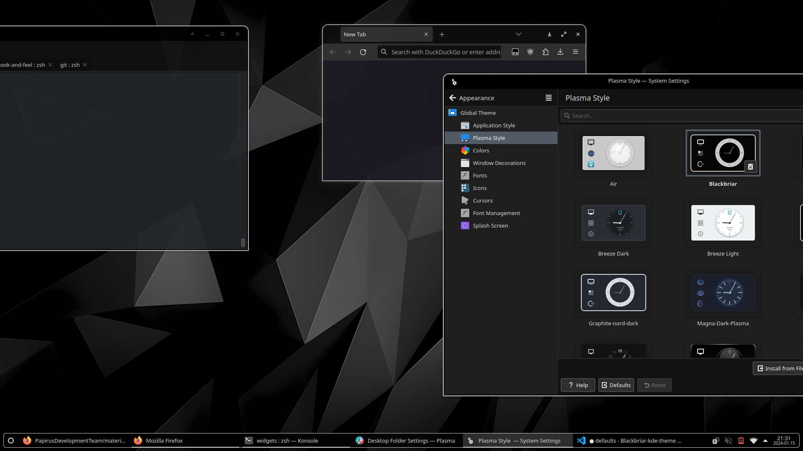

## Blackbriar KDE theme



Blackbriar-KDE is a sleek design theme for KDE Plasma desktop, focusing
on the contrast between black backgrounds and white outlines. Borrows from many
themes (see licensing/attribution).

In this repository you'll find:

- Aurorae Themes
- Kvantum Themes (I don't use this.)
- Plasma Color Schemes
- Plasma Desktop Themes
- Plasma Global Themes
- Wallpapers
- Icons

## Installation

### For the main theme, use these.

```sh
$ ./install.sh --help

Usage: ./install.sh [OPTION]
Install Blackbriar KDE into the current user HOME directory.
If no argument is specified, install the theme.

  -i, --install         Install theme (default action)
  -u, --uninstall       Uninstall theme
  -h, --help            Print this help message
```

Install theme for all users
```sh
sudo ./install.sh
```

Uninstall for current user
```sh
./install.sh --uninstall
```

### For recommended additions, use these.

- Use [Blackbriar GTK theme](https://github.com/swomf/Blackbriar-gtk-theme)
  and [Papirus-Dark](https://github.com/PapirusDevelopmentTeam/papirus-icon-theme) icons.
- [Kvantum engine](https://github.com/tsujan/Kvantum/tree/master/Kvantum)
  provides `kvantummanager`. I don't use it; this is here for posterity.

## Licensing/Attribution

GNU GPL v3 or later, with CC-BY-4.0 assets

| Resource          | Source               | License             |
|-------------------|----------------------|---------------------|
| Main forked theme | [Graphite-gtk-theme] | GPLv3               |
| General icons     | [Materia KDE]        | GPLv3               |
| Cursors           | [Qogir]              | GPLv3               |
| Login icons       | [FontAwesome]*       | CC BY 4.0           |
| Wallpaper         | [articted]           | "no commercial use" |

\* The [shutdown], [reboot], [settings], and [switchuser] SVG icons were
modified to change the color and default size.

[Graphite-gtk-theme]: https://github.com/vinceliuice/Graphite-gtk-theme
[Materia KDE]: https://github.com/PapirusDevelopmentTeam/materia-kde
[Qogir]: https://github.com/vinceliuice/Qogir-icon-theme/tree/master/src/cursors
[FontAwesome]: https://fontawesome.com/license/free
[shutdown]: https://fontawesome.com/icons/power-off?f=classic&s=solid
[reboot]: https://fontawesome.com/icons/gear?f=classic&s=solid
[settings]: https://fontawesome.com/icons/arrow-rotate-right?f=classic&s=solid
[switchuser]: https://fontawesome.com/icons/arrow-right-to-bracket?f=classic&s=solid
[articted]: https://www.behance.net/gallery/10876531/FLATzero-Wallpaper-Pack